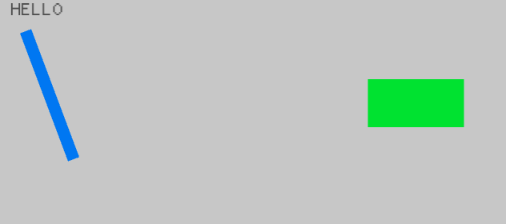

# rust-tuto

## Setup

- [Setup for Ubuntu 20.04](./SetupUbuntu.md)
- [Setup for Windows 11](./SetupWindows.md)

### Launch JupyterLab
```bash
# launch jupyter lab
## * port: 8888
## * token: empty
## * project path: ./
$ jupyter lab --port=8888 --ServerApp.token='' --project=.

## => http://localhost:8888/lab
```

- [01_get-started](./01_get-started/)

***

## WebAssembly tutorial

https://rustwasm.github.io/book/game-of-life/introduction.html

### Environment
- Rust: `1.55.0`
    - cargo-generate: `0.10.3`
- Node.js: `16.10.0`
    - npm: `8.1.0`
    - wasm-pack: `0.10.1`

#### Setup
```bash
# install wasm-pack
$ npm i -g wasm-pack

# confirm wasm-pack version
$ wasm-pack -V

wasm-pack 0.10.1
```

### Create WASM project
```bash
# create WASM template project: `wasm-life-game` from https://rustwasm.github.io/book/game-of-life/introduction.html
$ cargo generate -n wasm-life-game --git https://github.com/rustwasm/wasm-pack-template

# set current directory to ./wasm-life-game/
$ cd ./wasm-life-game/
```

#### Structure
```bash
wasm-life-game/
|_ src/
|  |_ lib.rs   # root rust crate that will be compiled to WebAssembly
|  |_ utils.rs # common utilities to make working with rust compiled to WebAssembly easier
|
|_ tests/ # test code
|  :
|
|_ Cargo.toml  # cargo metadata file
```

#### ./src/lib.rs
```rust
mod utils;

use wasm_bindgen::prelude::*;

// When the `wee_alloc` feature is enabled, use `wee_alloc` as the global
// allocator.
#[cfg(feature = "wee_alloc")]
#[global_allocator]
static ALLOC: wee_alloc::WeeAlloc = wee_alloc::WeeAlloc::INIT;

#[wasm_bindgen]
extern {
    fn alert(s: &str);
}

#[wasm_bindgen]
pub fn greet() {
    alert("Hello, wasm-life-game!");
}
```

### Build the project
```bash
$ wasm-pack build

## => wasm files will be compiled to ./pkg/
```

### Putting WebAssembly into a web page
```bash
# -- current directory: ./wasm-life-game/

# create wasm-app web project: `www`
$ npm init wasm-app www

$ cd www
```

#### ./www/package.json: add local dependent package `wasm-life-game`
```json
{
    // ...
    "dependencies": {
        "wasm-life-game": "file:../pkg" // add `wasm-life-game` package from ../pkg/
    }
}
```

#### ./www/index.js: import `wasm-life-game`
```javascript
import * as wasm from 'wasm-life-game';

wasm.greet();
```

#### install dependencies
```bash
# -- current directory: ./wasm-life-game/www/

# install dependencies from package.json
$ npm i
```

#### Serving local web application
```bash
# -- current directory: ./wasm-life-game/www/

# serve local web application
$ npm run start

## => http://localhost:8080/
### |> execute wasm.greet()
###    |_ wasm-life-game/src/lib.rs
###       |_ pub fn greet(): alert("Hello, wasm-life-game!")
```

***

## Macroquad

- **Macroquad**: https://macroquad.rs/
    - Simple and easy to use game library for Rust programming language.
    - UI, efficient 2D rendering, sound system included
    - First class browsers support, WebGL1 and iOS Safari supported
    - Linux/Mac/Windows/Android/iOS supported

### Creating a macroquad project
```bash
# create a rust project named `macroquad`
$ cargo new macroquad

$ cd macroquad

# add macroquad crate into the project
## * to use `cargo add` command, you must install cargo-edit
$ cargo add macroquad@0.3.0

## => macroquad/Cargo.toml
###   [dependencies]
###   macroquad = "0.3.0"
```

#### macroquad/src/main.rs: writing a macroquad sample code
```rust
// macroquad::prelude クレートをグローバルスコープに導入
use macroquad::prelude::*;

#[macroquad::main("BasicShapes")]
async fn main() {
    loop {
        // 背景色を薄灰色に設定
        clear_background(LIGHTGRAY);
      
        // 青い棒を描画
        draw_line(40.0, 40.0, 100.0, 200.0, 15.0, BLUE);
      
        // 緑の四角を描画
        draw_rectangle(screen_width() / 2.0 - 60.0, 100.0, 120.0, 60.0, GREEN);
      
        // 黄色い丸を描画
        draw_circle(screen_width() - 30.0, screen_height() - 30.0, 15.0, YELLOW);
      
        // 濃灰色で文字を描画
        draw_text("HELLO", 20.0, 20.0, 30.0, DARKGRAY);
      
        // 次のフレーム描画を待機
        next_frame().await
    }
}
```

#### Building the project to WebAssembly
```bash
# add wasm32 format to building target
$ rustup add wasm32-unknown-unknown

# build the project to wasm32 format
$ cargo build --target wasm32-unknown-unknown

## => compiled to macroquad/target/wasm32-unknown-unknown/debug/macroquad.wasm

# if you want to build the project as release binary
$ cargo build --target wasm32-unknown-unknown --release

## => compiled to macroquad/target/wasm32-unknown-unknown/release/macroquad.wasm
```

#### macroquad/index.html: writing a HTML Living Standard code for loading macroquad WebAssembly
```html
<!DOCTYPE html>
<html lang="en">
<head>
  <meta charset="UTF-8">
  <meta http-equiv="X-UA-Compatible" content="IE=edge">
  <meta name="viewport" content="width=device-width, initial-scale=1.0">
  <title>Macroquad - BasicShapes</title>
  <style>
    html,
    body,
    canvas {
       margin: 0px;
       padding: 0px;
       width: 100%;
       height: 100%;
       overflow: hidden;
       position: absolute;
       background: black;
       z-index: 0;
    }
 </style>
</head>
<body>
  <canvas id="glcanvas" tabindex='1'></canvas>
  
  <!-- Minified and statically hosted version of https://github.com/not-fl3/macroquad/blob/master/js/mq_js_bundle.js -->
  <script src="https://not-fl3.github.io/miniquad-samples/mq_js_bundle.js"></script>
  
  <!-- Your compiled wasm file -->
  <script>load("./target/wasm32-unknown-unknown/debug/macroquad.wasm");</script>
</body>
</html>
```

#### Serving local web application
```bash
# install basic-http-server crate for serving local web application
$ cargo install basic-http-server

# serve local web application
## locate macroquad/index.html
$ basic-http-server .

## => http://localhost:4000/
```


